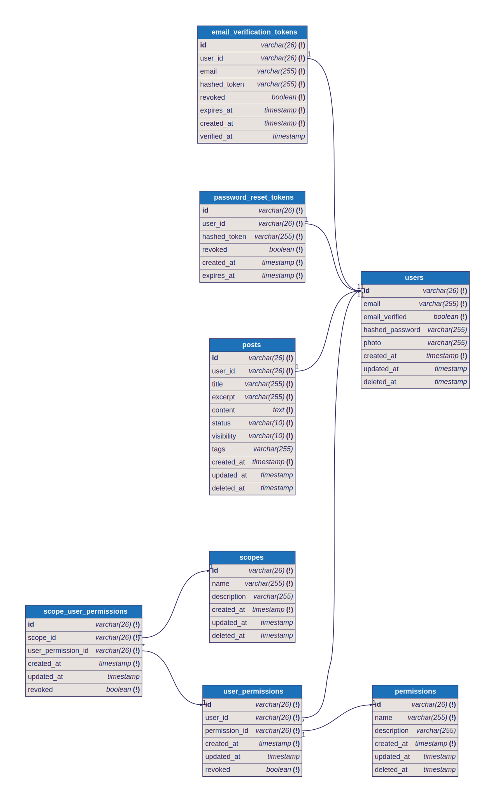

# Elysia PostgreSQL - Template

Opinionated template for building a REST API using [ElysiaJS](https://elysiajs.com/) and [PostgreSQL](https://www.postgresql.org/).

## 👨‍💻 Developer

**[@roniardev](https://github.com/roniardev)** - Maintainer

Specializing in:
- Full-stack development with modern technologies
- DevOps and automation
- Security-first development practices
- Performance optimization
- Team collaboration and knowledge sharing

## 🚀 Quick Start

```bash
# Clone the repository
git clone <your-repo-url>
cd elysia-pg

# Full development setup (recommended for new team members)
make full-setup

# Or step by step
make setup-dev
make db-migrate
make db-seed
```

## 🛠️ Makefile Automation

This project includes a comprehensive Makefile that automates all development, deployment, and release workflows. Run `make help` to see all available commands.

### 🐳 Docker Management

```bash
# Build and run services
make build          # Build production image
make build-dev      # Build development image
make up             # Start production services
make up-dev         # Start development services (exposes ports 5432, 6379)
make down           # Stop all services
make restart        # Restart all services

# Monitoring and debugging
make logs           # View all service logs
make logs-app       # Application logs only
make logs-db        # Database logs only
make logs-redis     # Redis logs only
make status         # Check service health
make monitor        # Real-time monitoring

# Container access
make shell          # Access application container
make shell-dev      # Access development database

# Cleanup
make clean          # Remove all containers, images, and volumes
```

### 🗄️ Database Operations

```bash
# Migration management
make db-generate    # Create new migration files
make db-push        # Push schema changes to database
make db-migrate     # Run pending migrations
make db-seed        # Seed database with initial data
make db-reset       # Reset database (drop and recreate)

# Database utilities
make db-diagram     # Generate database diagram
make db-connect     # Connect to production database
make db-connect-dev # Connect to development database
make backup         # Create database backup
make restore        # Restore database from backup
```

### 🛠️ Development Workflow

```bash
# Development server
make dev            # Start development server with hot reload

# Code quality
make lint           # Run linting checks
make lint-fix       # Fix linting issues automatically

# Code generation
make generate       # Generate CRUD operations

# Testing
make test           # Run test suite
```

### 🚀 Release Management

```bash
# Create releases
make release-patch  # Patch release (0.0.x) - bug fixes
make release-minor  # Minor release (0.x.0) - new features
make release-major  # Major release (x.0.0) - breaking changes
make release-custom # Custom version release

# Changelog and documentation
make changelog      # Generate comprehensive changelog
make changelog-preview # Preview changelog without writing
make release-notes  # Generate release notes for latest version

# Publishing
make release-push   # Push release tags to remote
make release-clean  # Clean up release artifacts
```

### 🔧 Utility Commands

```bash
# Dependency management
make install        # Install dependencies
make clean-deps     # Clean and reinstall dependencies

# Environment setup
make setup-dev      # Setup development environment
make setup-prod     # Setup production environment
make full-setup     # Complete development setup with database
```

## 🏗️ Technology Stack

- **Web Framework**: [ElysiaJS](https://elysiajs.com/) - Fast, type-safe web framework
- **Database**: [PostgreSQL](https://www.postgresql.org/) with [Drizzle ORM](https://orm.drizzle.team/)
- **Runtime**: [Bun](https://bun.sh/) - Fast JavaScript runtime and package manager
- **Linter**: [Biome](https://biomejs.dev/) - Fast formatter and linter
- **Containerization**: [Docker](https://www.docker.com/) with [Docker Compose](https://docs.docker.com/compose/)
- **Automation**: [Make](https://www.gnu.org/software/make/) - Build automation tool

### Elysia Plugins
- [CORS](https://elysiajs.com/plugins/cors.html) - Cross-origin resource sharing
- [Swagger](https://elysiajs.com/plugins/swagger.html) - API documentation
- [JWT](https://elysiajs.com/plugins/jwt.html) - JSON Web Token authentication
- [Autoload](https://github.com/kravetsone/elysia-autoload) - Route autoloading
- [Logger](https://github.com/bogeychan/elysia-logger) - Request logging
- [Bearer](https://elysiajs.com/plugins/bearer.html) - Bearer token authentication
- [Server Timing](https://elysiajs.com/plugins/server-timing.html) - Performance monitoring

## 📋 Prerequisites

- [Docker](https://www.docker.com/) and [Docker Compose](https://docs.docker.com/compose/)
- [Bun](https://bun.sh/) (JavaScript runtime and package manager)
- [Make](https://www.gnu.org/software/make/) (Build automation tool)

## 🏗️ Project Structure

```
elysia-pg/
├── app/                    # Application entry points
├── src/                    # Source code
│   ├── auth/              # Authentication system
│   ├── users/             # User management
│   ├── permissions/       # Permission system
│   ├── posts/             # Post management
│   └── general/           # General utilities
├── db/                    # Database configuration
│   ├── migrations/        # Database migrations
│   ├── schema/            # Database schemas
│   └── seeds/             # Database seeders
├── docs/                  # Generated documentation
│   ├── CHANGELOG.md       # Project changelog
│   └── RELEASE_NOTES_*.md # Release notes
├── scripts/               # Utility scripts
├── vibe-log/              # Project documentation
├── docker-compose.yml     # Production services
├── docker-compose.dev.yml # Development services
├── Dockerfile             # Application container
├── Makefile               # Build automation
└── package.json           # Project configuration
```

## 🗄️ Database Schema

### ERD (Entity Relationship Diagram)



The database schema includes:
- **Users**: User authentication and profile management
- **Permissions**: Role-based access control system
- **Posts**: Content management system
- **Scopes**: Resource access scoping
- **User Permissions**: Many-to-many relationship between users and permissions
- **Scope User Permissions**: Granular permission control per scope

## 🔄 Development Workflow

### Daily Development
```bash
# Start development environment
make up-dev
make dev

# Make changes and test
# ... your development work ...

# Stop services when done
make down
```

### Database Changes
```bash
# Modify schema files
# Generate and apply migrations
make db-generate
make db-migrate

# Add test data
make db-seed
```

### Code Quality
```bash
# Check code quality
make lint

# Fix issues automatically
make lint-fix

# Run tests
make test
```

## 🚀 Release Workflow

### 1. Development Phase
```bash
# Make changes and commit
git add .
git commit -m "feat: add new feature"
```

### 2. Release Creation
```bash
# Choose release type based on changes
make release-minor   # For new features
# OR
make release-patch   # For bug fixes
# OR
make release-major   # For breaking changes
```

### 3. Changelog Generation
```bash
# Generate comprehensive changelog
make changelog

# Or preview first
make changelog-preview
```

### 4. Publishing
```bash
# Push to remote repository
make release-push
```

### 5. Cleanup (Optional)
```bash
# Clean temporary files
make release-clean
```

## 🔒 Security Features

- **OWASP Compliance**: Built-in security measures and best practices
- **Environment Isolation**: Clear separation between production and development
- **Access Control**: Proper authentication and authorization
- **Audit Trail**: Comprehensive logging for all operations
- **Input Validation**: Secure handling of all user inputs

## 📊 Monitoring and Maintenance

### Service Health
```bash
make status          # Check service status
make monitor         # Real-time monitoring
make logs            # View service logs
```

### Release Tracking
- **Version History**: Complete version history in git tags
- **Change Logging**: All changes tracked in CHANGELOG.md
- **Release Notes**: Detailed notes for each release
- **Automated Cleanup**: Prevents artifact accumulation

## 🆘 Troubleshooting

### Common Issues
1. **Service Not Starting**: Use `make status` and `make logs`
2. **Database Connection**: Use `make db-connect-dev` to test
3. **Version Conflicts**: Ensure git is clean before release
4. **Permission Issues**: Verify Docker and git permissions

### Debug Commands
```bash
make status          # Service status
make logs            # Service logs
make shell-dev       # Database access
git status           # Git status
git tag --sort=-version:refname  # Version tags
```

## 🔗 Integration

### CI/CD Integration
```yaml
# Example GitHub Actions workflow
- name: Create Release
  run: |
    make release-patch
    make changelog
    make release-push
```

### Git Integration
- **Automatic Versioning**: Package.json always in sync with git tags
- **Commit Management**: Automatic commit creation for version changes
- **Tag Management**: Annotated tags with release messages
- **Remote Sync**: Automatic pushing to remote repository

## 📚 Documentation

- **`make help`** - Show all available commands
- **`docs/CHANGELOG.md`** - Project changelog
- **`scripts/release-demo.sh`** - Release workflow demonstration

## 🎯 Best Practices

### Development
- **Environment Management**: Always use `make down` before switching
- **Database Changes**: Use migrations for all schema changes
- **Code Quality**: Run linting before commits
- **Testing**: Ensure tests pass before release

### Release Management
- **Semantic Versioning**: Follow semver.org standards strictly
- **Commit Messages**: Use conventional commit format
- **Changelog Updates**: Generate changelog for every release
- **Release Timing**: Maintain consistent release schedule

### Security
- **Credential Management**: Use environment variables for secrets
- **Access Control**: Limit production access to authorized users
- **Audit Logging**: Monitor all release activities
- **Regular Updates**: Keep dependencies and images updated

## 🤝 Contributing

### Project Maintainer
**[@roniardev](https://github.com/roniardev)** - Senior Software Engineer & Project Maintainer

### Contribution Guidelines
1. **Setup Environment**: Use `make full-setup` for development
2. **Follow Standards**: Use provided linting and formatting rules
3. **Test Changes**: Ensure all tests pass before submitting
4. **Update Documentation**: Keep README and changelog current
5. **Security First**: Follow OWASP guidelines and security best practices
6. **Code Quality**: Maintain high standards for readability and performance

## 📄 License

This project is licensed under the MIT License - see the LICENSE file for details.

---

**Built with ❤️ by [@roniardev](https://github.com/roniardev) using [ElysiaJS](https://elysiajs.com/), [PostgreSQL](https://www.postgresql.org/), and comprehensive automation tools.**

---

**Maintained by [@roniardev](https://github.com/roniardev) - Senior Software Engineer specializing in modern web technologies, DevOps automation, and security-first development practices.**
