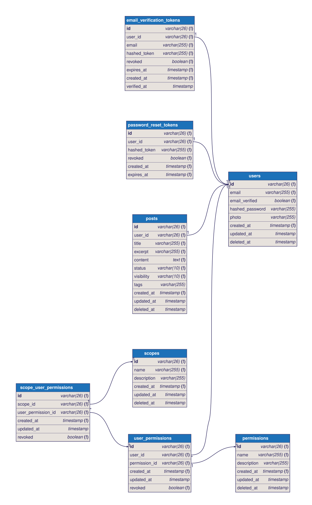

# Elysia PostgreSQL API

An Effect-based REST API built with [ElysiaJS](https://elysiajs.com/),
[PostgreSQL](https://www.postgresql.org/), and [Drizzle ORM](https://orm.drizzle.team/).
The application is organized as feature modules and uses explicit Effect graphs
for application behavior, failures, and dependencies.

## 👨‍💻 Developer

**[@roniardev](https://github.com/roniardev)** - Maintainer

Specializing in:
- Full-stack development with modern technologies
- DevOps and automation
- Security-first development practices
- Performance optimization
- Team collaboration and knowledge sharing

## 🚀 Quick Start

```bash
# Clone the repository
git clone <your-repo-url>
cd elysia-pg

# Full development setup (recommended for new team members)
make full-setup

# Or step by step
make setup-dev
make db-migrate
make db-seed
```

## 🛠️ Makefile Automation

This project includes a comprehensive Makefile that automates all development, deployment, and release workflows. Run `make help` to see all available commands.

### 🐳 Docker Management

```bash
# Build and run services
make build          # Build production image
make build-dev      # Build development image
make up             # Start production services
make up-dev         # Start development services (exposes ports 5432, 6379)
make down           # Stop all services
make restart        # Restart all services

# Monitoring and debugging
make logs           # View all service logs
make logs-app       # Application logs only
make logs-db        # Database logs only
make logs-redis     # Redis logs only
make status         # Check service health
make monitor        # Real-time monitoring

# Container access
make shell          # Access application container
make shell-dev      # Access development database

# Cleanup
make clean          # Remove all containers, images, and volumes
```

### 🐳 Production Image

`make build` produces a production image with:

- Base image `oven/bun:1.3.14` with `bun.lock` (text format) for reproducible installs
- A `tsc --noEmit` typecheck gate during the build
- Entrypoint `bun start` → `app/index.ts` (`NODE_ENV=production`)
- **Secrets are never baked in** — inject `DATABASE_URL`, Redis, and JWT keys at runtime via environment (see `docker-compose.yml` / `.env.example`)
- `.dockerignore` keeps local `.env*`, `node_modules`, and tests out of the build context

### 🗄️ Database Operations

```bash
# Migration management
make db-generate    # Create new migration files
make db-push        # Push schema changes to database
make db-migrate     # Run pending migrations
make db-seed        # Seed database with initial data
make db-reset       # Reset database (drop and recreate)

# Database utilities
make db-diagram     # Generate database diagram
make db-connect     # Connect to production database
make db-connect-dev # Connect to development database
make backup         # Create database backup
make restore        # Restore database from backup
```

### 🛠️ Development Workflow

```bash
# Development server
make dev            # Start development server with hot reload

# Code quality (ESLint 9 + no-ternary/no-else guard)
make lint           # Run linting checks
make lint-fix       # Fix linting issues automatically

# Testing
make test           # Run test suite
```

### 🚀 Release Management

```bash
# Create releases
make release-patch  # Patch release (0.0.x) - bug fixes
make release-minor  # Minor release (0.x.0) - new features
make release-major  # Major release (x.0.0) - breaking changes
make release-custom # Custom version release

# Changelog and documentation
make changelog      # Generate comprehensive changelog
make changelog-preview # Preview changelog without writing
make release-notes  # Generate release notes for latest version

# Publishing
make release-push   # Push release tags to remote
make release-clean  # Clean up release artifacts
```

### 🔧 Utility Commands

```bash
# Dependency management
make install        # Install dependencies
make clean-deps     # Clean and reinstall dependencies

# Environment setup
make setup-dev      # Setup development environment
make setup-prod     # Setup production environment
make full-setup     # Complete development setup with database
```

## 🏗️ Technology Stack

- **Web Framework**: [ElysiaJS](https://elysiajs.com/) 2.0.0-beta.14
- **Database**: [PostgreSQL](https://www.postgresql.org/) with [Drizzle ORM](https://orm.drizzle.team/)
- **Runtime**: [Bun](https://bun.sh/) 1.3.x - Fast JavaScript runtime and package manager
- **Linter**: [ESLint](https://eslint.org/) 9 (flat config) with TypeScript, stylistic, and essential plugins
- **Containerization**: [Docker](https://www.docker.com/) with [Docker Compose](https://docs.docker.com/compose/)
- **Automation**: [Make](https://www.gnu.org/software/make/) - Build automation tool
- **Application effects**: [Effect](https://effect.website/) - Typed success,
  error, and dependency graphs

### Elysia Plugins
- [CORS](https://elysiajs.com/plugins/cors.html) - Cross-origin resource sharing
- [Swagger](https://elysiajs.com/plugins/swagger.html) - API documentation
- [JWT](https://elysiajs.com/plugins/jwt.html) - JSON Web Token authentication
- Compression - Response compression through `elysia-compress`
- [Winston](https://github.com/winstonjs/winston) - Structured request logging
- [Bearer](https://elysiajs.com/plugins/bearer.html) - Bearer token authentication
- [Server Timing](https://elysiajs.com/plugins/server-timing.html) - Performance monitoring

## 🎨 Code Style

This template enforces a strict

- **No ternary operators** — use lookup maps, guard clauses, or `??` fallbacks instead
- **No `else` / `else if`** — use early returns and inverted guards (fail-fast first)
- **4-space indent, double quotes, no semicolons** — consistent formatting

Enforced by:

- **ESLint 9** with `@typescript-eslint`, `@stylistic/eslint-plugin`, `eslint-plugin-essential`, and `eslint-plugin-low-complexity`
- Rules: `no-ternary`, `no-nested-ternary`, `eslint-plugin-essential/no-else`, `eslint-plugin-essential/max-alternative-conditions` (maxElseIf: 0), plus naming conventions and stylistic formatting

`make lint` runs ESLint. `make lint-fix` auto-fixes what ESLint can.

## 🧭 Architecture and Contributor Guides

Application features follow a graph-first Effect architecture:

```text
input/param → use case graph → Effect<A, E, R>
```

- `A` is the successful domain result.
- `E` contains tagged domain or repository errors.
- `R` contains capabilities requested through Effect `Context` tags.

Elysia is only the untrusted HTTP boundary. It validates request parameters,
invokes the use case, and maps domain errors to HTTP responses. Domain use cases
do not import Drizzle, Redis, environment configuration, token libraries, or
other infrastructure concerns.

Each persisted operation has a focused source under `data/source/`. Repository
adapters wire those sources to domain repository capabilities; they do not own
application orchestration. Production values enter the graph through the
feature's layer composition.

- Start with the [documentation index](docs/README.md).
- Read the [Effect Design Thinking guide](docs/architecture/EFFECT_DESIGN_THINKING.md).
- Follow the [feature implementation playbook](docs/architecture/FEATURE_IMPLEMENTATION_GUIDE.md).
- Use the [testing guide](docs/architecture/TESTING_EFFECT_GRAPHS.md).
- Check the [migration status and process](docs/architecture/MIGRATION_GUIDE.md).
- Coding agents must also follow [AGENTS.md](AGENTS.md) and can use the
  project-scoped skills in `.agents/skills/`.

Run the complete architecture-aware local gate with:

```bash
bun run check
# or
make check
```

## 📋 Prerequisites

- [Docker](https://www.docker.com/) and [Docker Compose](https://docs.docker.com/compose/)
- [Bun](https://bun.sh/) ≥ 1.2 (developed on 1.3.14)
- [Make](https://www.gnu.org/software/make/) (Build automation tool)

## 🏗️ Project Structure

```
elysia-pg/
├── app/                        # Application entry points and runtime setup
├── src/                        # Feature modules
│   ├── auth/                   # Login, registration, and password flows
│   ├── authorization/          # Request authorization and scope checks
│   ├── permissions/            # Permission management
│   ├── posts/                  # Scope-aware post management
│   ├── user-permissions/       # User-permission assignments
│   ├── users/                  # User management and verification
│   └── general/                # Shared domain and runtime capabilities
│
│   Each feature module follows:
│       domain/entity/           — Framework-independent domain shapes
│       domain/repository/       — Capability contracts and tagged errors
│       domain/usecase/          — Effect application graphs
│       data/model/              — Persistence-to-domain mapping
│       data/source/             — One case-specific persistence operation
│       data/repository/         — Repository adapter and layer wiring
│       delivery/dto/            — HTTP parameter and response schemas
│       delivery/presenter/http/ — Elysia route boundary
│       layer.ts                 — Production dependency composition
│       index.ts                 — Feature route registration
├── db/                         # Database layer
│   ├── migrations/             # Drizzle migration files
│   ├── schema/                 # Schema definitions
│   └── seeds/                  # Seed data
├── utils/                      # Shared infrastructure utilities
├── test/                       # Bun unit test suites
├── logs/                       # Runtime application logs
├── docs/                       # Architecture and operational documentation
├── drizzle.config.ts           # Drizzle ORM config
├── schema.dbml / schema.svg    # Database ERD
├── eslint.config.mjs           # ESLint 9 flat config (no-ternary, no-else, stylistic)
├── docker-compose.yml          # Production services
├── docker-compose.dev.yml      # Development services (PG 5432, Redis 6379)
├── Dockerfile                  # Production image (oven/bun:1.3.14)
├── Makefile                    # Build, dev, DB, release automation
└── package.json                # Project configuration
```

### File and naming conventions

Feature files use snake_case and name the operation they implement:

```text
get_list_post_usecase.ts
get_post_by_id_persistent.ts
post_repository_impl.ts
create_post.ts
```

Use `get` for retrieval and explicit verbs such as `create`, `update`, and
`delete` for mutations. Use `param` for untrusted request input at the HTTP
boundary. Avoid generic `queries.ts`, `commands.ts`, `service.ts`, and
`get_data` or `set_data` names when a case-specific name is available.

See [CODE_STYLE.md](docs/architecture/CODE_STYLE.md) for the complete naming
and dependency rules.

## 🗄️ Database Schema

### ERD (Entity Relationship Diagram)



The database schema includes:
- **Users**: User authentication and profile management
- **Permissions**: Role-based access control system
- **Posts**: Content management system
- **Scopes**: Resource access scoping
- **User Permissions**: Many-to-many relationship between users and permissions
- **Scope User Permissions**: Granular permission control per scope

## 🔄 Development Workflow

### Daily Development
```bash
# Start development environment
make up-dev
make dev

# Make changes and test
# ... your development work ...

# Stop services when done
make down
```

### Database Changes
```bash
# Modify schema files
# Generate and apply migrations
make db-generate
make db-migrate

# Add test data
make db-seed
```

### Code Quality
```bash
# Check code quality (ESLint 9 with no-ternary/no-else rules)
make lint

# Fix issues automatically (ESLint --fix)
make lint-fix

# Run tests
make test
```

## 🚀 Release Workflow

### 1. Development Phase
```bash
# Make changes and commit
git add .
git commit -m "feat: add new feature"
```

### 2. Release Creation
```bash
# Choose release type based on changes
make release-minor   # For new features
# OR
make release-patch   # For bug fixes
# OR
make release-major   # For breaking changes
```

### 3. Changelog Generation
```bash
# Generate comprehensive changelog
make changelog

# Or preview first
make changelog-preview
```

### 4. Publishing
```bash
# Push to remote repository
make release-push
```

### 5. Cleanup (Optional)
```bash
# Clean temporary files
make release-clean
```

## 🔒 Security Features

- **OWASP Compliance**: Built-in security measures and best practices
- **Environment Isolation**: Clear separation between production and development
- **Access Control**: Proper authentication and authorization
- **Audit Trail**: Comprehensive logging for all operations
- **Request Validation**: Secure handling of all user-supplied parameters

## 📊 Monitoring and Maintenance

### Service Health
```bash
make status          # Check service status
make monitor         # Real-time monitoring
make logs            # View service logs
```

### Release Tracking
- **Version History**: Complete version history in git tags
- **Change Logging**: All changes tracked in CHANGELOG.md
- **Release Notes**: Detailed notes for each release
- **Automated Cleanup**: Prevents artifact accumulation

## 🆘 Troubleshooting

### Common Issues
1. **Service Not Starting**: Use `make status` and `make logs`
2. **Database Connection**: Use `make db-connect-dev` to test
3. **Version Conflicts**: Ensure git is clean before release
4. **Permission Issues**: Verify Docker and git permissions

### Debug Commands
```bash
make status          # Service status
make logs            # Service logs
make shell-dev       # Database access
git status           # Git status
git tag --sort=-version:refname  # Version tags
```

## 🔗 Integration

### CI/CD Integration
```yaml
# Example GitHub Actions workflow
- name: Create Release
  run: |
    make release-patch
    make changelog
    make release-push
```

### Git Integration
- **Automatic Versioning**: Package.json always in sync with git tags
- **Commit Management**: Automatic commit creation for version changes
- **Tag Management**: Annotated tags with release messages
- **Remote Sync**: Automatic pushing to remote repository

## 📚 Documentation

- **`make help`** - Show all available commands
- **`docs/CHANGELOG.md`** - Project changelog

## 🎯 Best Practices

### Development
- **Environment Management**: Always use `make down` before switching
- **Database Changes**: Use migrations for all schema changes
- **Code Quality**: Run linting before commits
- **Testing**: Ensure tests pass before release

### Release Management
- **Semantic Versioning**: Follow semver.org standards strictly
- **Commit Messages**: Use conventional commit format
- **Changelog Updates**: Generate changelog for every release
- **Release Timing**: Maintain consistent release schedule

### Security
- **Credential Management**: Use environment variables for secrets
- **Access Control**: Limit production access to authorized users
- **Audit Logging**: Monitor all release activities
- **Regular Updates**: Keep dependencies and images updated

## 🤝 Contributing

### Project Maintainer
**[@roniardev](https://github.com/roniardev)** - Senior Software Engineer & Project Maintainer

### Contribution Guidelines
1. **Setup Environment**: Use `make full-setup` for development
2. **Follow Standards**: Use provided linting and formatting rules
3. **Test Changes**: Ensure all tests pass before submitting
4. **Update Documentation**: Keep README and changelog current
5. **Security First**: Follow OWASP guidelines and security best practices
6. **Code Quality**: Maintain high standards for readability and performance

## 📄 License

This project is licensed under the MIT License - see the LICENSE file for details.

---

**Built with ❤️ by [@roniardev](https://github.com/roniardev) using [ElysiaJS](https://elysiajs.com/), [PostgreSQL](https://www.postgresql.org/), and comprehensive automation tools.**

---

**Maintained by [@roniardev](https://github.com/roniardev)